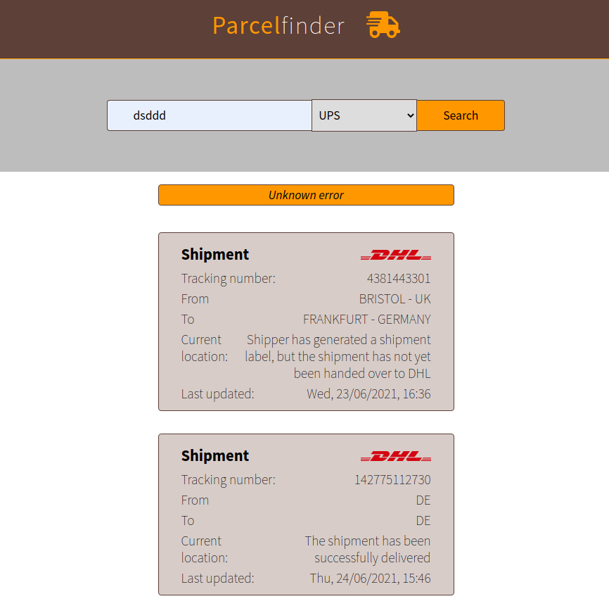
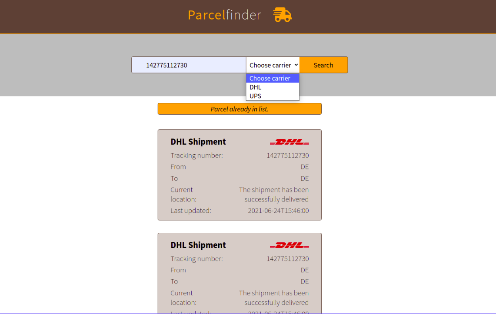

# Parcel FInder
## React App
>> 
We are building a parcel finder that takes a tracking number of a shipment and fetches the data(current state) from one "carrier" we provide in our App".
The requested parcels are displayed with their current state and await to be closed manually. 
Every non-closed is being saved into local storage and called from API on App load until erased manually.

### We are using a Deutsch Post development API for tracking the parcels
-local browser storage to store the parcel numbers 

#https://parcel-finder.netlify.app/

##DHL parcel numbers used for testing:
1.142775112730
2.4381443301
3.142775291429

